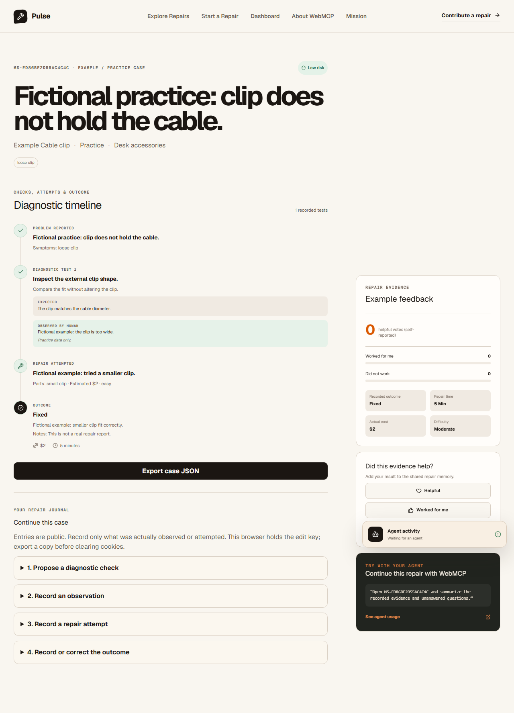

# Pulse

**A public repair journal for people and browser agents.** Record a problem, proposed checks, human observations, attempted fixes, and the final outcome. Search the saved history later. Every step works through ordinary forms; compatible agents can use the same database through ten WebMCP tools.

[Open Pulse](https://pulse.alx21.chatgpt.site/) · [Browse examples](https://pulse.alx21.chatgpt.site/repairs?source=examples) · [Start a repair](https://pulse.alx21.chatgpt.site/repair/new) · [Agent guide](WEBMCP_TESTING.md)



## Use it

1. Search community cases by product, symptom, outcome, or difficulty. Switch **Record source** to **Examples / practice** to explore fictional records.
2. Choose **Start a Repair**. Describe the object and the observed problem, then select its safety classification. Select **practice case** when trying fictional data.
3. Open the case. Use **Continue this case** to propose a check, record an observation, and document an attempt and its parts/cost.
4. Record the outcome, total cost in USD, whole minutes spent, and notes. Failures and professional-service decisions are useful outcomes too. Saving an outcome replaces the previous outcome; checks and attempts remain.
5. Reload to verify the saved evidence. Use **Export case JSON** for a readable copy of the journal. It does not contain the browser's edit credential and cannot restore editing access.

Everything submitted is **public**. Avoid personal information and serial numbers. The browser that creates a case receives an opaque, HttpOnly edit cookie; the server stores only its hash. Keep the same browser profile and cookies to continue editing. Clearing cookies or moving to another device removes editing access. There is no account, recovery flow, edit-key export, or public delete action. Existing cases created before browser ownership was introduced remain readable without an edit-claim mechanism.

Reading, searching, and exporting are public. Other visitors can leave self-reported feedback, counted once per feedback type per browser. This is not a verified identity or reputation system.

## Honest evidence

- The database starts with 30 clearly labeled **fictional examples**. New practice cases are labeled and separated with them. One precisely identified legacy automated test record is also relabeled as practice, preserving its history.
- Search defaults to community cases. Examples require the source filter; tool results include their source.
- Dashboard and homepage community totals exclude examples and practice. Outcomes are contributor reports, not independently verified physical repairs.
- Success rate is fixed/improved cases divided by all cases with an outcome. Open cases are excluded from that denominator. No outcomes means no rate.
- Median cost uses recorded outcome costs. Each case shows its actual recorded cost/time, with no invented price range.
- Database failures show an error instead of substituting fictional evidence. Statistics cover all saved cases. Search returns up to 50 matches; common-failure summaries explicitly describe their sample of up to 50 matching community cases.

Pulse organizes repair records; it does not diagnose an object or generate repair advice by itself. People supply physical observations. Cases classified **professional recommended** accept history and reported outcomes, but the server refuses new procedural diagnostic steps. Classification is contributor-supplied and is not a safety certification.

## WebMCP

The page registers tools through `document.modelContext.registerTool`, with a compatibility fallback for `navigator.modelContext`. Browsers without the API show a clear status and retain the full form workflow. No provider key or paid model is required by Pulse; an agent is optional and supplied by the visitor's browser.

WebMCP is experimental. Native checks use an isolated browser with `--enable-features=WebMCP`; installing ordinary Chrome alone does not enable the API. See [Chrome's WebMCP setup](https://developer.chrome.com/docs/ai/webmcp) and the [verification guide](WEBMCP_TESTING.md). The tool page reports actual discovery rather than labeling absent tools as registered. Registrations are removed on page hide and restored when the browser returns from its back-forward cache.

Compatibility checked on September 30, 2026:

| Browser/client                           | Verified behavior                                                                                                                                          |
| ---------------------------------------- | ---------------------------------------------------------------------------------------------------------------------------------------------------------- |
| Chrome 154.0.8037.93 with WebMCP enabled | Four native tests: all ten calls, visible journal updates, local D1 persistence, validation, ownership, professional-case boundaries and page restoration  |
| Edge 154.0.4258.48 with WebMCP enabled   | The same four native tests against the production Worker with local D1                                                                                     |
| Connected Codex browser agent            | All ten tools called on the public site using one explicitly fictional practice case; repeated feedback counted once and community totals stayed unchanged |
| Ordinary Chromium without WebMCP         | Six browser tests: complete forms, reload/export, ownership, feedback, unavailable data and mobile pages; tools report unavailable                         |

These are recorded checks of those versions, not a promise that every browser or agent supports the experimental API. Automated mutating fixtures use local D1. Live automated native checks perform discovery, reads and lifecycle checks; they skip the two fixture-writing tests.

The 1.0.1 local candidate was also checked with native Chrome 155.0.8059.39 and ordinary Chromium 145.0.7632.6. Its local checks cover all ten native calls, the complete practice journal, outcome correction, actual-backend failed writes retaining drafts, and edit permission after a stopped rebuild. These local results do not claim that the hosted site has been updated.

| Tool                    | What it does                                                                         |
| ----------------------- | ------------------------------------------------------------------------------------ |
| `search_repairs`        | Search community cases; optionally request examples or all records                   |
| `get_repair_case`       | Read the complete history, outcome notes, source, and this browser's edit permission |
| `create_repair_case`    | Publish a case; `practice: true` marks fictional data                                |
| `add_diagnostic_step`   | Propose a check on a case this browser owns; blocked for professional-risk cases     |
| `add_diagnostic_result` | Save a person's reported observation against a step                                  |
| `record_repair_attempt` | Record an attempted fix, parts, cost, and difficulty                                 |
| `record_repair_outcome` | Save or correct the current reported outcome                                         |
| `mark_case_helpful`     | Save helpful/worked-for-me/did-not-work feedback once per type and browser           |
| `list_common_failures`  | Summarize up to 50 matching community cases, with sample size disclosed              |
| `get_repair_statistics` | Read community totals and the separate example/practice count                        |

Tool responses are complete JSON, not strings cut at an arbitrary character limit. Community text is untrusted data. Tool metadata is static; input schemas and server validation enforce field limits. UI and tool writes share the same HTTP handlers, ownership checks, and D1 database. Agents can record only observations supplied by a person; use practice cases for fictional exercises.

## Run locally

Use Node.js 24 and pnpm 11.19.0 (the versions used in CI).

```sh
git clone https://github.com/agammann/pulse-webmcp.git
cd pulse-webmcp
pnpm install --frozen-lockfile
pnpm dev
```

Open the URL printed by the dev server. The Cloudflare plugin provides local D1 storage under `.wrangler/`; no API key is needed. Empty databases initialize the schema and example corpus automatically.

To run the built Worker:

```sh
pnpm build
pnpm start --port 3015
```

The built Worker stores local D1 in `.wrangler/state`, outside `dist`, so a rebuild preserves the journal and edit permission in the same browser. Before upgrading an existing 1.0.0 built-Worker database, stop it and back up `dist/server/.wrangler/state` **before building**; the previous default put local data inside the disposable build directory. See [the stability and recovery guide](docs/STABILITY.md) for migration and stopped local backup/restore. Public JSON exports cannot replace a database backup or recover a cleared browser cookie.

The public site uses the same build with a durable D1 binding named `DB`, declared in `.openai/hosting.json`. Local D1 is separate from the public database. Sites deploys `dist/` from a source commit; GitHub Actions verifies source changes but does not deploy them automatically. Hosting a separate copy requires your own compatible Cloudflare/Sites environment and may have hosting costs.

## Verify changes

```sh
pnpm test
pnpm lint
pnpm typecheck
pnpm audit
pnpm test:audit-policy
pnpm security:audit
pnpm exec playwright install chromium
pnpm build
pnpm test:e2e
pnpm exec playwright install chrome
pnpm test:webmcp
pnpm test:persistence
```

The 1.0.1 source includes available dependency patches, but `pnpm audit` still reports the unpatched high-severity braces advisory [GHSA-vfj7-8cjw-p6xm](https://github.com/advisories/GHSA-vfj7-8cjw-p6xm), including its production dependency classification. The maintainer explicitly accepted that exact finding for Pulse; `pnpm security:audit` preserves it and fails on changed metadata or paths, additional findings, or an available patch. A passing policy is not an audit with no findings. See [Security](SECURITY.md), [CHANGELOG](CHANGELOG.md) and [STABILITY](docs/STABILITY.md).

To build a reproducible source archive from a clean committed checkout, run `pnpm release:package`. It creates `pulse_1.0.1_source.zip` and SHA-256 sidecars in `release-artifacts/`. With Python 3.12 or newer, run `python scripts/unpack-release.py --out ../pulse-consumer` to verify exact source bytes and extract a new folder outside the checkout, then follow the same install/build/start steps there. The source archive excludes dependencies, build output, private files, and local databases.

Unit tests cover ranking, boundaries, metadata, cookies, and statistics including more than 50 cases. Browser tests run the built Worker with local D1 and cover the full ordinary-browser repair journal, reload/export, ownership, feedback deduplication, professional-case boundaries, source filtering, unavailable data, mobile pages, and all ten tool adapters. The adapter test uses a test-only registry; `test:webmcp` separately asserts the browser's native implementation and invokes its discovered tools. CI runs both suites and retains native browser versions and results.

To adapt the pattern, keep each capability in a shared HTTP handler, define its contract in `lib/webmcp-contracts.ts`, and expose it through both the forms and native provider. Preserve server ownership and validation checks. Replace the fictional corpus and product metadata for your domain, then prove that a tool write updates the visible page and survives a reload. Run the negative cases and ordinary-browser workflow as part of the same release.

## Source map

- `app/api/` — shared HTTP reads and writes
- `lib/database.ts` — D1 state and additive schema initialization
- `lib/session.ts`, `lib/access.ts` — browser edit key and write boundary
- `lib/validation.ts`, `lib/tool-input.ts` — server and tool input checks
- `lib/search.ts`, `lib/statistics.ts` — deterministic ranking and reported totals
- `components/repair-editor.tsx` — manual journal forms
- `components/webmcp-provider.tsx`, `lib/webmcp-contracts.ts` — native registration and ten contracts
- `drizzle/0000_pulse.sql`, `drizzle/0001_browser_editors.sql`, `drizzle/0002_legacy_practice.sql` — initial and additive schemas; runtime uses idempotent creation

## Limits

Pulse has no contributor accounts, moderation dashboard, cross-device editing, or deletion UI. Rate limiting is basic and instance-local. Browser cookies limit accidental duplicate feedback; clearing them can create a new voter identity. Outcome corrections replace the current outcome rather than preserving revisions. Search is a deterministic in-memory ranking over loaded case rows, suited to a small collection. Public case text and safety classifications are self-reported.

MIT licensed. See [LICENSE](LICENSE) and [security and safety policy](SECURITY.md).
